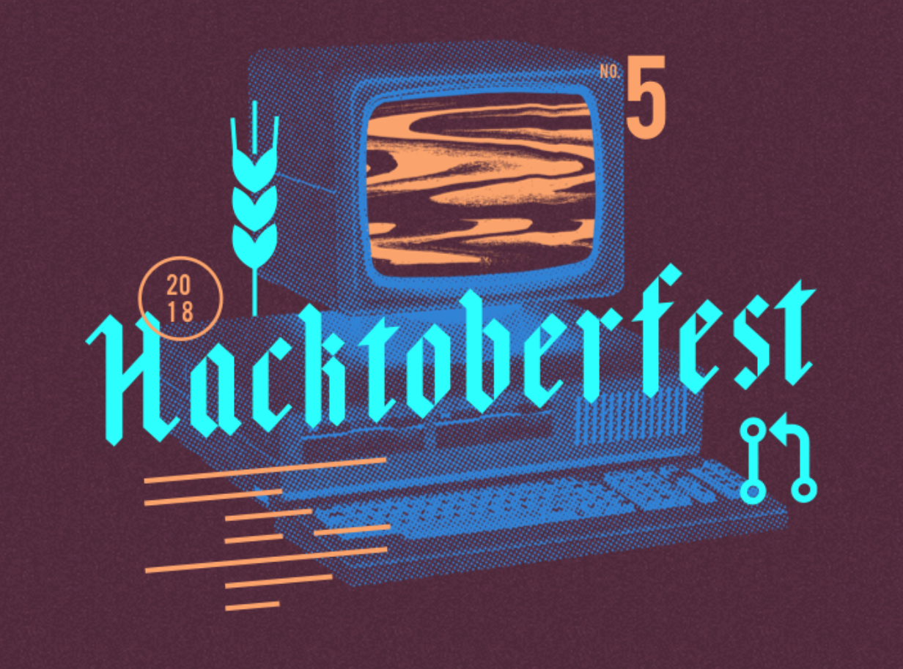

Before becoming a developer, I spent a decade working in film and television, so when I first started transitioning into tech, I spent a lot of time networking, going to Meetups and having coffee with other developers. I was primarily interested in **finding out what I needed to know to become employable and how I could go about learning those skills**. I heard a few answers consistently: do online tutorials, build your portfolio and contribute to open source projects.

The first two are relatively straightforward, but contributing to open source software (OSS) is a bit more opaque, especially for new developers. While the “hows” of contributing can be a bit unclear, the “whys” are much more tangible.

Image source <a href="https://pixabay.com/users/rawpixel-4283981/">Rawpixel</a>

**Employers are often looking for developers who have worked on a team** before, which can be a catch-22 for new developers who have only built side projects or done freelance work by themselves. By contributing to OSS, you will learn tools teams use industry-wide to collaborate, including version control systems and platforms like GitHub.

You will also gain experience in the “soft-skills” of engineering like how to communicate and collaborate with other developers. It also gives you an opportunity to give back to the community and help others who are earlier in their developer journey, much like you were before.

**Open source projects provide an opportunity for developers to learn skills that will make them more employable.** Here’s how you can get started!

### Why contribute to open source?

Before we get into the “hows” of open source, let’s talk a bit about the “whys”. As a developer, some benefits for participating in the OSS community include:

1. You will **learn common team-based workflows**, including how to use version control systems like git and platforms like GitHub
2. You will gain experience **communicating and collaborating** with other developers
3. You can **give back** to the developer community

All great opportunities! Now, let’s talk about how to get started!

### How do I find an open source project?

Figuring out where to start is hard. There are tons of projects out there that are currently being worked on, but how do you know which one is the right one for you? There are a few small ways you can make the search a bit easier.

First off, I’d recommend looking at repositories for tools you use on a daily basis. This will give you an advantage because you will be more familiar with the product, what it’s intended to do, and how it can be improved.

Another way to find good projects is to search GitHub for repos built using your strongest programming language. When getting started, **you want to reduce your barrier to entry**, so adding a completely new language to the mix could dramatically slow your progress.

Lastly, I suggest looking for projects that are being actively developed. The last thing you want to do is spend a lot of time and effort working on a project that has been deprecated. A few easy ways to determine a project’s vitality are:

1. Look at when the last commit was made. If it’s been a long time, odds are the project has lost momentum.
2. Check out how many stars the repo has. Stars indicate community interest in the project.
3. See how many contributors the project has. The more, the better because you’ll have plenty of people to ask for help.

Image source <a href="https://pixabay.com/users/rawpixel-4283981/">Rawpixel</a>

### How do I contribute to an open source project?

Now that you’ve found a project to work on, let’s talk about OSS workflows and how you get your code merged.

First things first, **look at the project’s website (or README file) for a contribution guide**. These guides will usually describe the projects’s preferred code style, general workflow and provide instructions for setting up your local development environment.

A very common workflow used in open source projects goes something like this:

1. Fork the project repo and make a copy for yourself
2. Clone the repo to your local machine and boot up the development environment
3. Commit your code changes to git
4. Push your work to a feature branch in your fork
5. Open a PR against the original project repo

One thing to note here is that your local git repo will be tracking TWO different repos on GitHub, which are often called “origin” and “upstream”. Origin refers to the forked repo in your GH account whereas “upstream” points to the original project repo. To keep you local copy up to date, you’ll want to `git pull upstream [branch]` before starting on a new issue. Then, when you’re done and ready to push up your code, you’d run `git push origin [branch]` and then open a pull request.

If the paragraph above confused you, don’t worry—you’re definitely not alone! **I use git every day and still find myself needing to reference documentation** on a regular basis. Before you proceed, feel free to check out this [handy git guide from Atlassian](https://www.atlassian.com/git/tutorials/syncing) if you want to brush up.

Once you’ve opened your pull request, project maintainers will review your code, potentially ask for changes and merge your code in. This process is a great opportunity to learn from more experienced developers, which can help build your real-world development skill set.

### How do I find issues to work on?

Now that you’ve found a project and understand the general workflow, where do you find issues to work on? **The best place to look is on the project repo’s issues page.** On large projects, this page may have hundreds, if not thousands of open issues for you to choose.

Large repositories like [Gatsby](https://github.com/gatsbyjs/gatsby/issues) will usually be well organized and make use of GitHub’s project management features like labels and assignees. Projects of this scale often have a core team maintaining the project while simultaneously coordinating the work done by community contributors.

Labels can be very helpful when trying to find your first issue. Many projects will make use of labels like “good first issue”, “beginners”, or “help wanted” to denote issues where the maintainers are looking for help. If someone has already begun work on an issue, you’ll often see them assigned to the issue or a status label indicating it’s in progress.

Another great place to find things you can work on is the project’s Slack channel or Discord server. Often, **the project’s core team will be available to offer guidance, answer questions and provide general feedback** on your work. As they will have a more intimate knowledge of the codebase, they are also great resources, especially when first getting started.

If you don’t have any luck finding issues in a specific repo, be on the lookout for seasonal community events like [Hacktoberfest](https://hacktoberfest.digitalocean.com/) or [24 Pull Requests](https://24pullrequests.com/). These events aggregate beginner-friendly issues from a wide variety of projects, which helps make it easier to find things to work on. Awesome!

Image source <a href="https://hacktoberfest.digitalocean.com/">Digital Ocean</a>

### Learning from open source

My first contribution to an open source project was [a simple documentation change for Brunch](https://github.com/brunch/brunch.github.io/pull/207), a build tool I was using at the time. Simply because I was using it, I noticed a typo in the docs and decided to fix it. It certainly wasn’t a mind-blowing enhancement, but at least the next person reading the docs would have a slightly better experience.

Not too after, I discovered the GitLab repo, which had a lot of open style related issues. Since CSS was my strong suit at the time, I made a habit of submitting PRs to the project on a regular basis. **Ultimately, this helped me land my first development job because I was already familiar team-based workflows.** Had I not been working on open source projects, I would not have had this experience.

Recently, I jumped back into the world of open source by updating some Gatsby documentation and logging on to their Discord server. In a short period, I’ve been able to help some new Gatsby developers, which has been a great reminder of how far I’ve come. I know more than some and less than others, which allows me to help the former while also learning from the latter. And that’s why the open source is so great!

So, go find a project, learn something and have fun coding!
